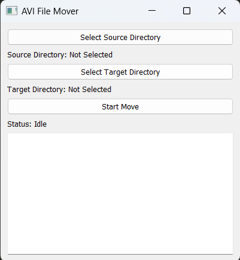
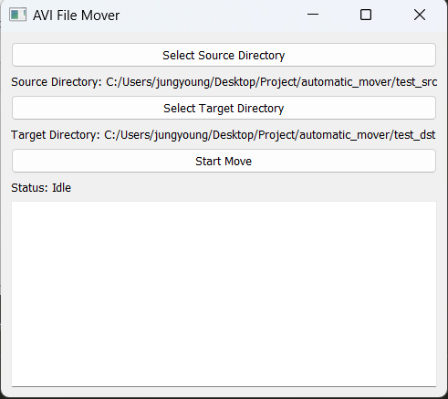
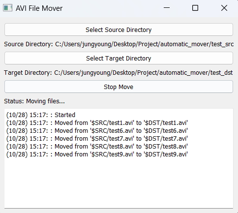
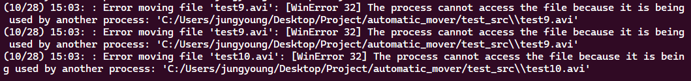

# Prerequisite
모든 설명은 터미널(cmd)을 해당 파일들이 저장된 경로로 이동 후 실행하는 것을 가정함.
```bash
> cd <MODEL_DIRECTORY>
```

# 필요한 패키지 설치
pyqt5설치 필요 (requirements 파일 그대로 설치)
```
> pip install -r requirements.txt
```

# 사용 방법
1. 파일 실행

```python
> python main.py
```

아래와 같은 창 생성됨



2. source & target directory 설정

Select Source Directory 버튼과 Select Target Directory 버튼을 눌러 소스 경로 (스트림픽스에서 동영상을 저장하는 경로)와 파일이 옮겨질 경로를 설정

설정 예시



3. 실행
Start Move이버튼 클릭

다음과 같이 파일이 이동되면 다음과 같이 로그가 생성됨. 



커맨드 창에 다음과 같은 에러가 발생할 수 있는데, 이는 파일이 여전히 쓰기 중이어서 이동할 수 없다는 얘기. 동영상 용량이 크다면 쓰기 시간이 오래 걸려서 같은 에러가 발생할 수 있지만, 다 써진 후에는 자동으로 옮겨지기에 문제 없음.
다만 다른 에러가 발생할 시는에 연락 주세요.


4. 멈추기

Stop Move 버튼을 누르면 자동으로 멈춤

## 주의 & 참고사항
1. 실행 중에는 커맨드 (cmd) 창을 종료하지 말 것
2. 영상 포맷을 avi파일 포맷에서 다른 포맷으로 변경 시, main.py 파일의 ".avi"를 해당 포맷 (예: ".mp4")로 변경하여 실행
3. 파일을 탐색하는 주기를 조정하고 싶으면 main.py 파일은 SEARCH_DUR을 조정 (second 단위)

# 테스트
1. 같은 경로에 다음 두 이름을 갖는 디렉토리 생성
- test_src
- test_dst

2. 다음 코드 실행
```python
> python tester.py
```
.avi 확장자를 가진 dummy 파일이 매 12초마다 생성 (tester.py 파일의 DUR 변수를 조절하여 조정 가능)

3. 메인 코드 실행
```python
> python main.py
```
source directory와 target directory를 각각 test_src, test_dst로 설정 후 실행 (이 때 SEARCH_DUR을 줄여서 사용하기를 권장)